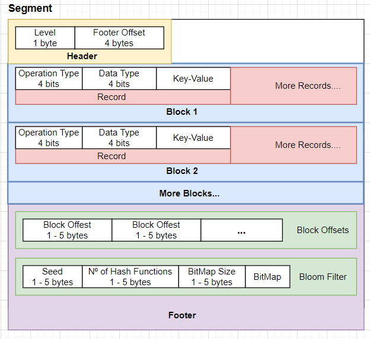

# KeyValueDB
无聊练手

Just for fun.


A naive implementation of Key-Value based database. The architecture and implementation are not professional neither elegant, but the most important thing is it works.

只是一个键值对数据库的简单实现。架构和代码实现并不优雅, 但是, 能跑就完事了。

# How to run
run `Server.kt` to start the Database

run `Client.kt` to communicate with the DB.

Supporting operations: `set`, `get` and `del`

# Example
```
set language kotlin # stores the key-value pair (`language`, `kotlin`)
> done
get language # get the associated value with the key `language`
> kotlin
del language # delete the key-value pair from the DB
> done 
```

# What you can find implemented in this project
- SSTables
- Compression Algorithm (prefix sharing between strings, Vint and Vlong)
- Bloom Filter
- Reactor Model
- Index File (composite by multiple Blocks and a Bloom Filter)

# Index file structure

